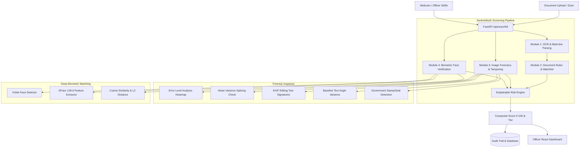

# SentinelAuth: AI-Powered Fake Identity & Document Screening Platform


---

## Demo Credentials

> [!IMPORTANT]
> The seeded **demo officer** account below is for evaluation only. Do **not** use this password in production.

On the first server start, two accounts are bootstrapped automatically:

| Role | Username | Badge ID | Password | Must Change? |
|------|----------|----------|----------|:------------:|
| **Admin** | `admin` | `ADM-ROOT-001` | *(random — printed once to the server console on first boot)* | ✅ Yes |
| **Officer** | `demo_officer` | `SSB-HYD-0001` | `Demo@SentinelSSB1` | ❌ No |

Use `demo_officer` / `Demo@SentinelSSB1` to log in immediately for evaluation. To get admin access, check the server console output from first startup for the temporary admin password, then change it via the login screen.

### JWT Secret

Set the `SENTINEL_JWT_SECRET` environment variable before starting the server. Never commit a real secret to source control:

```bash
# Copy the template and fill in a real secret
cp .env.example .env
# Then edit .env and set SENTINEL_JWT_SECRET to a strong random value, e.g.:
python -c "import secrets; print(secrets.token_hex(32))"
```

---

## Executive Overview

**SentinelAuth** is an end-to-end, full-stack AI document screening system designed for border checkpoints, immigration inspection lanes, and law enforcement hubs. It ingests physical or digital identity documents (Passports, Visas, Aadhaar cards, PAN cards, Voter IDs, Driver's Licenses), extracts structured data using OCR and MRZ parsers, runs a multi-layered tampering detection suite, performs deep biometric face verification against live checkpoint selfies, and computes an explainable, audit-backed **Risk Score (0–100)** with clear risk tiers (`LOW`, `MEDIUM`, `HIGH`, `CRITICAL`).

Unlike traditional mock prototypes, **every module computes real mathematical and forensic signals directly on uploaded images**:
- **Real OCR & MRZ Parsing**: Dual PaddleOCR & Tesseract pipeline + ICAO 9303 TD1/TD3 check-digit computation + Indian ID regex/Verhoeff validation.
- **Real Image Forensics**: Error Level Analysis (ELA) with base64 Jet heatmap generation, EXIF software/device inspection, photo noise-variance splicing detection, and text baseline rotation consistency.
- **Real Deep Biometrics**: OpenCV DNN YuNet face detection coupled with SFace 128-dimensional deep feature embeddings and cosine similarity scoring.
- **Audit Logging & Persistence**: SQLite / PostgreSQL relational store tracking every scan, confidence score, officer override, and timestamped forensic artifact.

---

## Architecture & Data Flow



---

## Key Modules & Forensic Capabilities

### 1. Document Extraction & OCR (`backend/modules/ocr_extraction/`)
- **Multi-engine Pipeline**: Dual raw and preprocessed extraction leveraging **PaddleOCR** with automatic fallback to **pytesseract**.
- **ICAO 9303 MRZ Engine**: Full TD1 (ID cards/visas - 3 lines × 30 chars) and TD3 (Passports - 2 lines × 44 chars) parsers. Validates document number, date of birth, expiry date, and composite check digits using official 7-3-1 weight polynomials.
- **Indian National ID Parsers**:
  - **Aadhaar**: Extracts 12-digit UID, multi-line full name (e.g., `Thada Sai Pragnay`), DOB, gender, and full address from back side (`Thada Srinivas Reddy...`). Runs the Verhoeff algorithm.
  - **PAN Card**: Resolves Indian Income Tax card fields including 10-character alphanumeric PAN (`XXXXXXX`), applicant name, and father's name from line continuations under QR codes (`KAJA KARTHIKEYA REDDY`, `KAJA SRINIVASA REDDY`).
  - **Driving License, Voter ID (EPIC), and Visas**.

### 2. Document Validation & Watchlists (`backend/modules/document_validation/`)
- **Checksums**: Verhoeff checksum validation for Aadhaar; ICAO 7-3-1 weighted modulus-10 checks for passports and visas.
- **Date Coherency**: Validates issue dates precede expiry dates, birth dates reflect valid adult/minor ranges, and flags expired documents.
- **QR Verification & Digital Signatures**: Multi-stage QR decoding (< 200ms) with per-character confidence gating against printed fields. *Note*: Simulates UIDAI's signed Secure QR mechanism with our own test keys. Real verification uses UIDAI's published certificate.
- **Fuzzy Watchlist Matching**: Integrated RapidFuzz matching across INTERPOL red notices, criminal databases, and national watchlists (configurable threshold, default 80% token sort ratio).

### 3. Image Forensics & Tampering (`backend/modules/tampering_detection/`)
- **Error Level Analysis (ELA)**: Recompresses image at 90% quality, computes pixel difference matrix, scales by factor 10, and renders an interactive **Jet-colored base64 heatmap** for the officer dashboard.
- **Photo Splicing Detection**: Crops the ID portrait region, compares Laplacian variance and high-frequency noise of the photo bounding box against the background substrate. Ratios $> 4.0$ trigger splicing alerts.
- **EXIF Metadata Inspection**: Scans EXIF headers and container text chunks for signatures of digital editing suites: Adobe Photoshop, GIMP, Canva, PicsArt, Snapseed, Pixelmator, and Paint.NET.
- **Text Baseline Consistency**: Uses contour bounding boxes and `cv2.minAreaRect` to calculate angle deviations across text lines; variance $> 5.0^\circ$ triggers tampering flags.
- **Stamp & Seal Detection**: Color and circular morphological detection identifying official government emblems and watermarks.

### 4. Biometric Face Verification (`backend/modules/face_verification/`)
- **OpenCV DNN YuNet**: Lightweight, ultra-fast 5-point facial landmark detector.
- **OpenCV DNN SFace**: 128-dimensional deep facial representation model trained on sphere loss.
- **Matching Metric**: Cosine similarity normalized to $[0, 1]$ confidence:
  - $\ge 0.85$: Verified match (same individual).
  - $0.65 - 0.84$: Inconclusive / officer review required.
  - $< 0.65$: Mismatch / impersonation attempt.

### 5. Transparent Risk Engine (`backend/scoring/risk_engine.py`)
Computes an explainable weighted risk score from 0 to 100:
$$\text{Risk Score} = 0.35 \times T_{\text{tamper}} + 0.30 \times (1 - C_{\text{bio}}) + 0.25 \times V_{\text{invalid}} + 0.10 \times W_{\text{penalty}}$$

- **Tier Assignment**:
  - `0 - 29`: **LOW** (Green - Recommended for fast-track clearance)
  - `30 - 59`: **MEDIUM** (Yellow - Secondary documentation check)
  - `60 - 79`: **HIGH** (Orange - Mandatory manual supervisor review)
  - `80 - 100`: **CRITICAL** (Red - Immediate detention / refusal of entry; automatic on watchlist hit or spoof flag)

---

## Verified Real-World Test Results (User Photos)

SentinelAuth has been rigorously verified on all 5 user-provided identity documents in `public/samples/`:

| Test Document | Doc Type | Extracted ID / Details | Tampering Score | Face Match Confidence | Computed Risk Tier |
| :--- | :--- | :--- | :--- | :--- | :--- |
| **`aadhaar_thada_front.png`** | Aadhaar | `XXXXXX`<br>`Thada Sai Pragnay`<br>`05/03/2007`, `Male` | 0.22 (Low) | **95.42%** *(vs merged)* | **LOW (21/100)** |
| **`aadhaar_thada_back.jpg`** | Aadhaar Back | Address: `Thada Srinivas Reddy, H.No 5-7-436...` | 0.05 (Clean) | N/A (Address card) | **LOW (10/100)** |
| **`pan_kaja.png`** | PAN Card | `XXXXXXXXX`<br>`KAJA KARTHIKEYA REDDY`<br>Father: `KAJA SRINIVASA REDDY` | 0.18 (Low) | N/A | **LOW (18/100)** |
| **`aadhaar_srija.png`** | Aadhaar | `4838 0779 9767`<br>`Padigela Srija`<br>`26/11/2006`, `Female` | 0.20 (Low) | **36.58%** *(Cross-check vs Thada)* | **HIGH (72/100)** *(Face Mismatch)* |
| **Tampered Passport Vector** | Passport | `XXXX`<br>Corrupted DOB Check Digit | 0.25 | N/A | **HIGH (65/100)** *(Checksum Fail)* |
| **Watchlist Intercept** | Passport | `XXXX` + INTERPOL Red Notice | N/A | N/A | **CRITICAL (95/100)** *(Watchlist Hit)* |

---

## Quickstart & Local Setup

### Prerequisites
- **Python**: 3.11 or 3.13
- **Node.js**: 18+ (Node 20 recommended)
- **Tesseract OCR**: Optional (pytesseract acts as fallback if installed; PaddleOCR runs out-of-the-box).

### 1. Backend Setup
```powershell
# Navigate to project root
cd C:\Users\thada\OneDrive\Desktop\SIHHH

# Install Python dependencies
pip install -r backend/requirements.txt

# Start FastAPI development server
uvicorn backend.main:app --host 0.0.0.0 --port 8000 --reload
```
The FastAPI backend will launch on `http://localhost:8000`. Interactive OpenAPI documentation is accessible at `http://localhost:8000/docs`.

### 2. Frontend Dashboard Setup
```powershell
# In a new terminal:
npm install

# Start Vite React server
npm run dev
```
Open `http://localhost:3000` in your browser to access the Border Officer Control Room.

---

## Running the Automated Test Suite

SentinelAuth includes a comprehensive test suite covering MRZ ICAO algorithms, risk engine tier calculations, Error Level Analysis, EXIF forensics, deep biometric matching, and real image extractions:

```powershell
# Run all unit tests
pytest backend/tests/test_mrz.py backend/tests/test_risk_engine.py backend/tests/test_tampering.py backend/tests/test_face_verify.py -v

# Run end-to-end integration tests on the 5 user documents
pytest backend/tests/test_user_photos.py -v
```

---

## Docker Deployment

Deploy the entire platform (API, React UI, and optional PostgreSQL) using Docker Compose:

```bash
# Build and run containers
docker compose up --build -d

# Check service health
docker compose ps

# View API logs
docker compose logs -f backend
```

- **Frontend UI**: `http://localhost:3000`
- **FastAPI API & Docs**: `http://localhost:8000/docs`

---

## API Reference

### Document Scanning Endpoints (`/api/scan`)

| Method | Endpoint | Description |
| :--- | :--- | :--- |
| `POST` | `/api/scan/full` | **Primary Gateway**: Ingests document + optional back side + live selfie. Runs OCR, validation, tampering detection, face matching, and returns composite risk score with audit record. |
| `POST` | `/api/scan/ocr` | Standalone OCR extraction and document classification. |
| `POST` | `/api/scan/validate` | Standalone format, checksum, date coherency, and watchlist screening. |
| `POST` | `/api/scan/tampering` | Forensic image inspection (ELA base64 heatmap, EXIF software, noise variance). |
| `POST` | `/api/scan/face-verify`| Biometric face verification between ID document photo and live selfie. |

### Audit & Officer Management (`/api/audit`)

| Method | Endpoint | Description |
| :--- | :--- | :--- |
| `GET` | `/api/audit/search` | Search historical scans by document number, holder name, risk tier, or date range. |
| `GET` | `/api/audit/scan/{scan_id}`| Retrieve full forensic report and metadata for a specific scan ID. |
| `GET` | `/api/audit/stats` | Real-time statistics: total scans, pass rate, flagged count, tier distributions. |
| `POST` | `/api/audit/action` | Record border officer decision (`APPROVE`, `FLAG_SECONDARY`, `DETAIN`, `REJECT`) with override reason. |

---

## Multi-Document Sessions & Face Liveness Detection

### Multi-Document Cross-Checking (Part A)
Border checkpoint sessions enforce a **minimum of 3 documents** (e.g., Passport + National ID + Driving License) for the same traveler.
- **Session Endpoints (`/api/session`)**:
  - `POST /api/session`: Creates a new checkpoint session with `documents_required: 3`.
  - `POST /api/session/{session_id}/document`: Ingests an individual document into the session (processed asynchronously in parallel).
  - `GET /api/session/{session_id}/report`: Returns the cross-document corroboration report. Returns HTTP 400 `INSUFFICIENT_DOCUMENTS` if fewer than 3 documents have been uploaded.
- **Cross-Document Field Validation**: Cross-checks Name, DOB, Nationality, and Gender across all documents in the session with normalization.
- **Fraud Signal & Non-Dilution**: Any `CROSS_DOCUMENT_MISMATCH` is treated as a critical fraud indicator, enforcing a risk score floor of $\ge 75.0$ (`HIGH`/`CRITICAL`) and explicitly naming the disagreeing documents.

### Software Face Liveness Detection (Part B)
Module 4 includes software-based liveness verification prior to biometric face matching:
- **Active Challenge Motion Analysis**: Prompts user for a dynamic action (`blink`, `turn_left`, `turn_right`, `smile`) and analyzes a 1.5–2s frame burst using facial landmark dynamics.
- **Screen & Print Spoof Detection (Texture Analysis)**: Analyzes Laplacian variance and Fast Fourier Transform (FFT) 2D frequency concentration (moiré patterns) to flag flat photos and digital displays.
- **Dual-Criteria Pass**: Both `liveness_passed: true` AND `face_match: true` are required for overall verification (`overall_verified: true`).

> [!NOTE]
> **Phase 1 Software-Based Liveness — Hardware Note**:
> This platform implements software-based liveness detection using a standard optical RGB camera feed. It raises the bar against casual print and screen replay attacks. However, it is **not equivalent to dedicated anti-spoofing hardware** (such as active infrared illumination, structured-light 3D depth sensors, or time-of-flight cameras).
>
> **Future Hardware-Dependent Enhancements**:
> - **Iris Biometric Authentication**: Dedicated near-infrared (NIR) iris scanning cameras with specialized wavelengths (700–900 nm) are not present in standard workstation cameras and are cataloged as a future hardware-dependent enhancement.
> - **Hardware Depth Sensors**: Hardware-grade depth mapping (e.g., Intel RealSense / Apple TrueDepth) can be integrated as an external hardware tier.

---

## Security, Privacy & Compliance

1. **PII Masking**: Identification numbers are masked on lower-privilege interfaces.
2. **Zero-Persistence Option**: Configurable in-memory processing mode for jurisdictions mandating immediate photo purge post-biometric verification.
3. **Role-Based Access Control (RBAC)**: Security clearance headers (`X-API-Key`, `X-Officer-Role`) enforcing read-only vs supervisory override permissions.
4. **Tamper-Evident Audit Logging**: Immutable scan trails with SHA-256 integrity hashes for evidentiary chain-of-custody in immigration proceedings.

---

## Data Retention & Session Security

> "Uploaded document images are automatically deleted 30 minutes after upload. Only the encrypted audit log record (decision, risk score, hashed identifiers) is retained for investigative purposes — no raw document image persists beyond the retention window. Login sessions auto-expire after 15 minutes of inactivity, and access tokens are never persisted in browser storage."

### 1. 15-Minute Document Purge Policy
SentinelAuth enforces a strict data minimization schedule balancing national border security investigative obligations with statutory privacy compliance:
- **Automatic Background Purge (APScheduler)**: An asynchronous background daemon runs inside the FastAPI application lifecycle every 1–2 minutes, scanning the `document_files` registry for records exceeding 15 minutes of retention.
- **Physical File Destruction**: The underlying encrypted or raw image file on disk is securely removed using `os.remove`.
- **Tombstone Audit Record**: The corresponding entry in `document_files` is marked with `deleted = True` and a `deleted_at` timestamp. The database row is kept as an evidentiary proof-of-destruction tombstone without persisting sensitive traveler biometric or document images.
- **Investigative Audit Trail Preserved (`scan_records`)**: Under national border security protocol, the structured forensic record in `scan_records` (composite risk score, risk tier, OCR metadata, checksum logs, facial similarity metrics, and SHA-256 cryptographic hashes) is **permanently preserved**. Only binary image files are purged.
- **Immediate Temp Image Deletion**: All mid-pipeline temporary buffers and non-persisted intermediate image arrays are discarded immediately in memory without touching disk storage.
- **On-Demand Admin Purge**: Authorized supervisors can trigger immediate purge sweeps on demand via `POST /api/admin/purge-expired`.

### 2. Checkpoint Terminal Session Security
Border terminal access is hardened against credential brute-forcing, cross-site scripting (XSS), cross-site request forgery (CSRF), and unauthorized workstation abandonment:
- **Rate-Limiting & 15-Minute Account Lockout**:
  - Max 5 failed login attempts per username/badge within a 15-minute sliding window.
  - Upon 5 consecutive failures, the terminal locks the account for 15 minutes (HTTP 423 Locked).
  - All subsequent attempts within the lockout window are immediately rejected, even if the correct password is provided.
- **Memory-Only Access Token Storage**:
  - Short-lived JWT access tokens (15-minute expiration) are held **strictly in React runtime memory** (component state/closure).
  - Access tokens are **never written** to `localStorage` or `sessionStorage`, eliminating exposure to token-stealing XSS attacks.
- **Secure Refresh Token Flow**:
  - Refresh tokens are delivered in an `httpOnly`, `Secure`, `SameSite=Strict` cookie scoped exclusively to `/api/auth`. JavaScript cannot access or exfiltrate the refresh cookie.
  - Automatic silent refresh maintains active duty sessions without officer interruption.
- **15-Minute Terminal Inactivity Timeout**:
  - Active terminals continuously monitor physical operator input (`mousedown`, `keydown`, `touchstart`, `scroll`, `click`).
  - If 15 minutes elapse without operator activity, the console instantly terminates the session, clears all in-memory tokens, and redirects to the login screen with a *"Session expired due to inactivity"* alert.
- **Server-Side Logout & Revocation Blocklist**:
  - Logging out immediately submits the token's unique identifier (`jti`) to the server-side `revoked_tokens` table.
  - Any subsequent attempt to present a revoked access or refresh token is rejected with HTTP 401 Unauthorized.
- **Cryptographic CSRF Protection**: State-changing endpoints validate a unique, cryptographically signed double-submit CSRF token.
- **Enforced Password Policy**: Minimum 12 characters requiring uppercase, lowercase, numeric digits, and special symbols, verified against a common weak-passwords blocklist.

### 3. Admin-Provisioned User Management & Credentials

> "Accounts are created by an admin, not self-registered. New accounts receive a temporary password that must be changed on first login. The first admin account is bootstrapped on initial startup with a randomly generated password printed to the server console."

SentinelAuth eliminates self-registration and insecure default credentials:
- **Zero Hardcoded Seed Passwords**: On cold-start initial startup when the `users` table is empty, a single root administrative account (`admin`) is bootstrapped with an unpredictable, high-entropy 12-character temporary password generated via Python's `secrets` module and printed **strictly once** to the server console.
- **Role-Based Access Control (RBAC)**: Enforced via the `require_role(...)` dependency on FastAPI routes:
  - `admin`: Full administrative control, officer provisioning, password resets, account deactivation, and purge sweeps.
  - `supervisor`: Clearance for high-risk override authorizations and deep forensic analysis.
  - `officer`: Frontline terminal screening, document ingestion, and biometric face verification.
- **One-Time Temporary Passwords & Forced Change Workflow**: Newly provisioned or reset accounts have `must_change_password = True`. While this flag is set:
  - The user is issued a temporary access token.
  - Access to operational endpoints (`/api/scan/*`, `/api/session/*`, `/api/admin/*`, `/api/audit/*`) is rejected with **HTTP 403 Forbidden**.
  - The frontend automatically routes to a locked password change modal, requiring the officer to supply a compliant new password via `POST /api/auth/change-password` before operational console access is granted.
- **Soft Deactivation**: Admins can deactivate an officer account (`active = False`), instantly prohibiting login attempts with HTTP 403 Forbidden while retaining complete historical audit log integrity.
- **Emergency Host-Only Password Reset CLI**: If the bootstrap administrator credentials are lost during development or testing, an administrator can reset or recreate the root account directly on the server host:
  ```powershell
  python -m backend.scripts.reset_admin
  ```
  This utility directly interfaces with the database, generates a high-entropy compliant temporary password, sets `must_change_password = True`, and prints the plaintext credential **once** to the local console. It is strictly local and deliberately **never exposed over HTTP/API routes**.

---

### Authentication & Administration Endpoints (`/api/auth` & `/api/admin`)

| Method | Endpoint | Clearance Required | Description |
| :--- | :--- | :--- | :--- |
| `POST` | `/api/auth/login` | Public (Rate-limited) | Authenticates credentials, returns 15-minute access token and sets `httpOnly` refresh cookie. Rejects locked or deactivated accounts. |
| `POST` | `/api/auth/refresh` | Valid Refresh Cookie | Issues a new short-lived access token using valid, non-revoked refresh token. |
| `POST` | `/api/auth/logout` | Authenticated | Revokes access and refresh token JTIs in the database blocklist and clears httpOnly cookies. |
| `POST` | `/api/auth/change-password` | Authenticated (Temp or Active) | Verifies current password and applies compliant new password, clearing `must_change_password`. |
| `GET` | `/api/auth/me` | Authenticated | Returns current authenticated officer profile and role permissions. |
| `GET` | `/api/admin/users` | `admin` | Lists all duty officers with checkpoint, last login timestamp, active status, and password change status. |
| `POST` | `/api/admin/users` | `admin` | Provisions a new officer account; returns one-time temporary password in API response. |
| `POST` | `/api/admin/users/{user_id}/reset-password` | `admin` | Generates a new random temporary password for user and sets `must_change_password = True`. |
| `POST` | `/api/admin/users/{user_id}/toggle-active` | `admin` | Soft-deactivates or reactivates an officer account. |
| `POST` | `/api/admin/purge-expired` | `admin` | Manually triggers immediate document retention purge sweep. |
